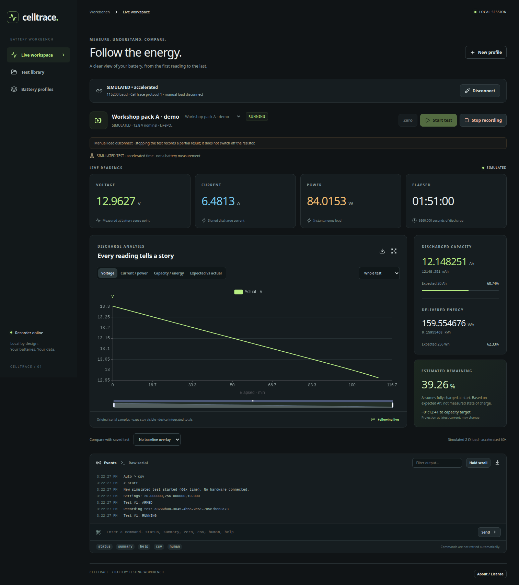
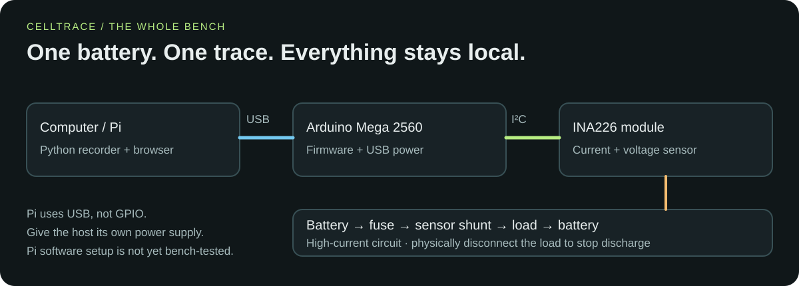
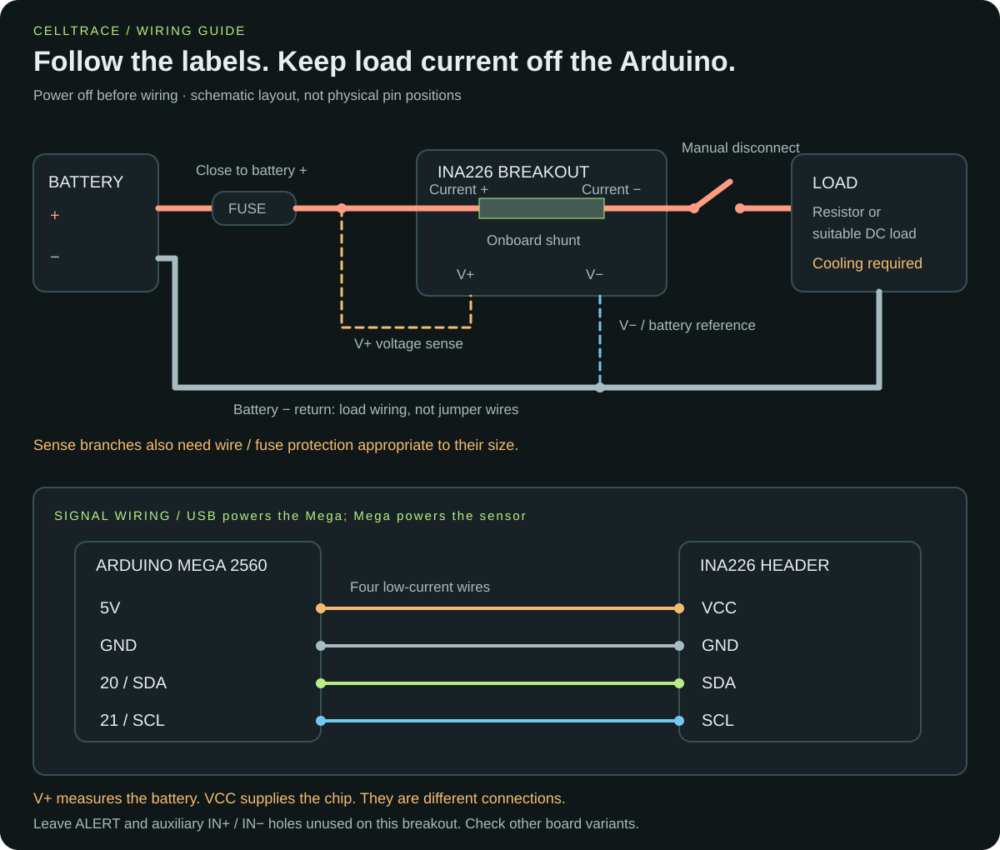
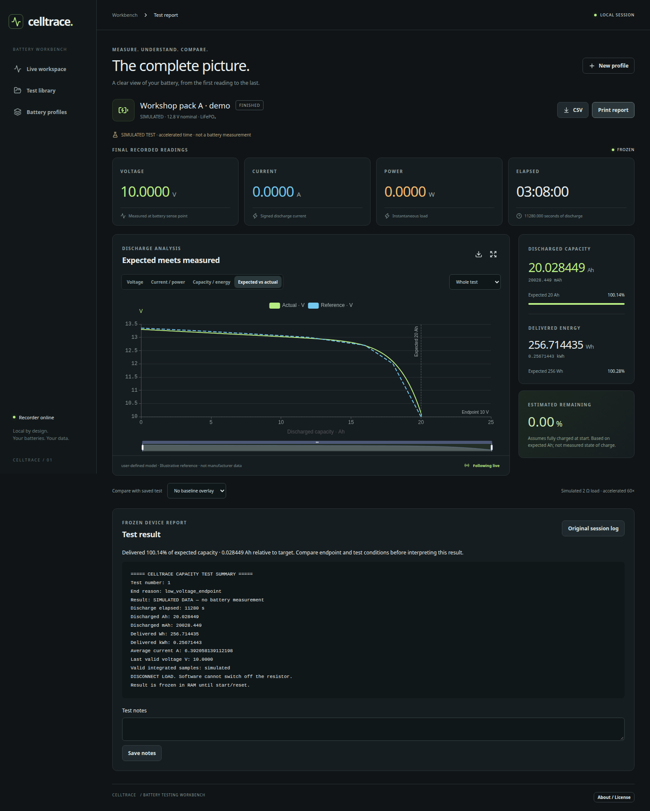

<div align="center">

# celltrace.

**Follow the energy. Know your batteries.**

A local battery-capacity tester with live graphs, reusable battery profiles,
and results you can keep and compare.

**Arduino Mega + INA226 · Python + React / TypeScript · GPLv3 or later**

[Quickstart](#quickstart) · [Wiring](#wiring) · [Using the dashboard](#using-the-dashboard) · [Troubleshooting](#troubleshooting) · [License](#license)



*The actual CellTrace dashboard, running a clearly labeled simulated test.*

</div>

CellTrace measures how much charge and energy a battery delivers into a load.
Watch voltage, current, power, elapsed time, **Ah / mAh**, and **Wh / kWh** as the
test runs. Save the result, add notes, and compare the next battery against it.
No cloud account is needed; your recordings stay on your computer.

Profiles work with different brands and chemistries. **The electrical setup still
has limits:** the supplied firmware has 15 V and 10 A software guardrails. Those
are not guaranteed safe ratings for your sensor board, wiring, or load. A different
profile does not make higher-voltage or higher-current hardware compatible.

> **CellTrace measures; it does not switch off the load.** You must physically
> disconnect the load when the test ends or if something goes wrong. Stop,
> low-voltage detection, and faults freeze the result; discharge can continue.
> Use a fused, properly cooled setup and stay with it while testing.

## Quickstart

### 1. Gather the parts

| Part | What to look for |
| --- | --- |
| Host computer | Linux with Python 3.12+ and a browser. The current setup was tested on Linux Mint. See the Pi note below. |
| Arduino | **Mega 2560**, plus a USB data cable. Other Arduino boards are not yet validated. |
| Current/voltage sensor | INA226 breakout with a suitably rated shunt, terminals, and PCB. This guide shows a four-terminal board marked **Current +, Current −, V+, V−**, with an **R002 = 0.002 Ω** shunt. |
| Battery and charger | One battery at a time, with its specified charger and a known discharge endpoint. |
| Discharge load | A suitably rated power resistor or DC electronic load, with the required cooling. CellTrace does not control an electronic load. |
| Connections | Fuse/holder near battery positive, suitable wire and connectors, and a DC-rated manual disconnect. A Mega screw-terminal shield is optional for signal wires. |
| Verification | A multimeter to check voltage and wiring before testing. |

Download the repository ZIP and extract it, or clone it, then open a terminal
in the project folder—the one containing this README and `platformio.ini`.
The following commands run from that folder unless stated otherwise.

### 2. Install and try the dashboard

Install Python 3.12+ with its virtual-environment support, and Node.js 24 LTS with
npm. On x86-64 Linux, setup can download a local Node runtime if one is missing.
On Debian/Ubuntu-based systems, `python3-venv` supplies virtual-environment support;
check `python3 --version` before proceeding.

```sh
python3 tools/setup_celltrace.py
./celltrace
```

Open **http://127.0.0.1:8765** if the browser does not open automatically.
Choose **Try demo → Start test → Verify settings & arm** to explore without any
hardware. Demo time runs at 60× speed and the results are labeled simulated.
Disconnect the demo before connecting real hardware.

Setup installs locked dependencies into `.venv` and builds the dashboard.
It **does not upload Arduino firmware**. Internet is needed for installation,
but the built application runs locally without it.

<details>
<summary>Using a Raspberry Pi as the host</summary>

The Pi runs the Python recorder and dashboard server; the Mega still reads the
INA226. Connect a Pi USB port to the Mega's USB socket with a data cable. Power the
Pi using its own suitable supply. **No Pi GPIO wiring is used.** Direct INA226-to-Pi
support is not implemented.

Use an OS providing Python 3.12+ and install Node.js 24 LTS/npm for your Pi's ARM
architecture before running setup. The automatic Node downloader only supports
x86-64 Linux. This Pi arrangement is intended by the host/USB design, but has not
yet been bench-tested. Desktop Linux is the verified path.

You can flash the Mega from a separate computer before connecting it to the Pi.
For a headless host, start the recorder without opening a browser:

```sh
.venv/bin/python tools/celltrace.py
```

See [remote access](#remote-access) to view it from another computer.

</details>

### 3. Wire the bench

Disconnect the battery and USB power while assembling. Follow the
[wiring guide below](#wiring), and leave the load disconnected for now.



### 4. Configure and upload the Arduino

Install [PlatformIO IDE for VS Code](https://docs.platformio.org/en/latest/integration/ide/vscode.html)
or [PlatformIO Core](https://docs.platformio.org/en/latest/core/installation/index.html).
Open this project folder in PlatformIO.

Check [`include/TesterConfig.h`](include/TesterConfig.h) before building:

- `SHUNT_OHMS` must match **your actual shunt**. The supplied value is `0.002` for R002.
- Default Ah, Wh, and endpoint settings are examples. The web dashboard applies
  your selected profile before each test.
- Hardware limits and current thresholds must suit the complete circuit.
  Do not increase the limits just to silence a fault.

With the load disconnected, plug in the Mega. Close other serial monitors and
use the dashboard's **Disconnect** button if it owns the port. Use PlatformIO's
**Build** and **Upload**, or:

```sh
pio run
pio device list
pio run -t upload --upload-port /dev/ttyACM0
```

Replace `/dev/ttyACM0` with the port listed for your board. If `pio` is not on PATH
but the VS Code extension is installed, use a PlatformIO terminal or
`~/.platformio/penv/bin/pio` on Linux.

**Uploading, resetting, or opening a new serial connection can erase the Mega's
current totals and zero offset. Do this between tests.** The firmware does not
resume a test automatically. The platform is pinned to `atmelavr@5.3.0`; the sensor
driver uses Arduino's built-in Wire library, with no external INA226 library.

### 5. Run your first real test

1. **Prepare the battery.** Fully charge it using its specified procedure. Remove
   the charger and follow any recommended rest period. Connect one battery to the
   fused measurement circuit, keeping the load disconnected.
2. **Connect.** Launch `./celltrace`, choose the Mega's port and **115200 baud**, and
   select **Connect**. The connection should identify **CellTrace protocol 1**.
3. **Check and zero.** Compare displayed voltage against a multimeter. Select
   **Zero** with the load physically disconnected; calibration takes about three
   seconds. Current should be near zero.
4. **Create a profile.** Enter a useful name, battery identifier, chemistry and
   nominal voltage. Enter rated Ah/Wh if known; otherwise leave them blank. Choose
   an endpoint appropriate to the battery manufacturer's discharge instructions.
   Record load and temperature in the test conditions.
5. **Arm, then apply the load.** Select the profile, click **Start test → Verify
   settings & arm**, and wait for **ARMED**. Connect the load. Sustained positive
   current of at least **0.10 A for 0.5 seconds** starts **RUNNING**, elapsed time,
   and the graphs. Very small loads need a separately reviewed threshold change.
6. **Watch the test.** Check readings, connections and cooling. If you stop early,
   the result is a partial discharge. At an endpoint or fault, **physically
   disconnect the load immediately**.
7. **Keep the result.** Open **View report** or **Test library**. Add notes, export
   CSV, or print/save a PDF. Recharge the battery using its specified procedure.

Keep the recorder terminal running. Closing or refreshing the browser does not
stop recording; closing the recorder does. Neither action disconnects the load.

<details>
<summary>Returning later, replacing the Mega, or changing the sensor</summary>

- Existing installation: open the project folder and run `./celltrace`.
- Fresh computer: install prerequisites and run `python3 tools/setup_celltrace.py`.
- New Mega: recheck wiring and configuration, upload firmware, identify its new
  serial port, connect and zero again. A new board does not arrive with CellTrace.
- New INA226: verify the board's terminal functions, shunt resistance and ratings;
  update `SHUNT_OHMS`, build and upload if necessary. Zero corrects offset, not an
  incorrect shunt value or current gain.
- Check voltage against a trusted meter and check current with a known suitable
  load before relying on capacity results. Recharge before a full capacity test
  if the check removed appreciable charge.
- A different Arduino model needs a porting review: pinout, logic voltage, Wire
  timeout support, memory, and PlatformIO board selection can differ.
- Settings and zero offset are RAM-only. Reset restores firmware defaults;
  the dashboard reapplies a profile when starting a test.

</details>

## Wiring

This diagram is for the **four-terminal INA226 breakout described above**.
INA226 boards vary: match the printed labels and board schematic, not connector
position or wire color. Some breakouts connect voltage sensing differently.



| Connection | Destination |
| --- | --- |
| Battery **+** | Fuse close to battery → INA226 **Current +** |
| INA226 **Current −** | Manual load disconnect → load input / one resistor end |
| Load return / other resistor end | Battery **−**, through load-rated wiring |
| INA226 **V+** | Fused battery positive, separate voltage-sense branch |
| INA226 **V−** | Battery negative / voltage reference |
| INA226 **VCC** | Mega **5V** |
| INA226 **GND** | Mega **GND** |
| INA226 **SDA** | Mega **20 / SDA** |
| INA226 **SCL** | Mega **21 / SCL** |
| Host USB | Mega USB socket; independently powered host |

**20 and SDA are the same signal on the Mega; 21 and SCL are the same signal.**
Use either corresponding labeled connection, not an extra wire to both.
See the [official Mega pinout](https://docs.arduino.cc/resources/pinouts/A000067-full-pinout.pdf).

**VCC is the sensor's logic supply; V+ is its battery-voltage input. Do not swap
them.** Current − goes to the load, not directly to battery negative. On this
breakout, V− is tied to the sensor ground, and the GND header shares that reference
with the Mega. Leave ALERT and the small auxiliary IN+/IN− holes unused.
Verify that reference arrangement before using a different breakout.

Keep load current out of the Arduino, screw-terminal shield, breadboard and thin
jumper wires. Protect thin sense branches with an appropriate branch fuse or
wire sized for the upstream protection. The [INA226 chip datasheet](https://www.ti.com/lit/ds/symlink/ina226.pdf)
does not establish the current or thermal rating of a complete breakout board.

### Choosing a load and fuse

A fixed resistor is simple; its current falls as the battery voltage falls.
A suitable DC electronic load can provide a different discharge profile, but it
must be configured and stopped independently of CellTrace.

For a resistor, calculate at the battery's **highest test voltage**, not only its
nominal voltage:

```text
Current (A) = voltage (V) / resistance (Ω)
Power   (W) = voltage (V)² / resistance (Ω)
```

**Example only:** a 2 Ω resistor takes 6.4 A / 81.9 W at 12.8 V, and
7.3 A / 106.6 W at 14.6 V. A resistor labeled “200 W” may require a specified
heatsink and airflow to reach that rating. Choose resistance, continuous power
rating, mounting and cooling together; keep hot parts away from the battery and
wires. Improvised contact with cookware is not a verified thermal design.

Choose a DC-rated fuse/holder for normal current, wire and connector ratings,
and the battery's possible fault current. A **10 A fuse is only a candidate for
that particular example**, not a universal recommendation. It must protect the
weakest downstream conductor, with separately protected branches where needed.
The software current limit cannot interrupt a short circuit.

Use the battery's specified discharge endpoint. The supplied **10.0 V default is
an example for the original 12.8 V LiFePO₄ bench**, not a universal endpoint.
Do not deliberately lower it below a BMS threshold to force a trip. An observed
loss of output can also be a disconnected lead or blown fuse; CellTrace cannot
prove BMS operation from external voltage/current alone.

## Using the dashboard

| Area | What you can do |
| --- | --- |
| Live workspace | See voltage, signed current, power, elapsed time, Ah/mAh and Wh/kWh, target percentages and estimated remaining capacity. |
| Graph tabs | Follow voltage, current/power, capacity/energy, and expected-versus-actual discharge. Hover for readings; zoom, resume live, or export PNG. |
| Battery profiles | Store identity, chemistry, ratings, endpoint, test conditions and optional reference curves. |
| Test library | Reopen past runs, compare a baseline, and turn a saved trace into a reference profile. |
| Test report | Read the frozen firmware summary, add notes, export sample CSV or original serial log, and print/save PDF. |
| Events / raw serial | Search messages, hold scrolling, and type commands in a fixed input area with Up/Down history. |



*Completed demo run. Reference points are illustrative, not manufacturer data.*

### Targets and reference curves

Expected Ah/Wh create target markers and delivered percentages. **A rated capacity
alone cannot define an ideal voltage curve.** Supply a manufacturer curve, a
previous measurement, or your own labeled model for a meaningful overlay.

Use **New profile / Edit profile → Reference discharge curve → Import CSV**, or
paste points. This example shows the format, not a validated battery curve:

```csv
ah,voltage_v
0,13.4
10,12.9
20,10.0
```

Provide at least two points with strictly increasing Ah and finite, nonnegative
values. The header is optional. Select a reference source and record its load,
temperature and endpoint conditions. CellTrace interpolates between points only;
it does not extrapolate beyond them. Saved runs can also be selected as baselines.

**Estimated remaining % assumes a full battery at start** and subtracts discharged
Ah from expected Ah. It is not measured state of charge. Unknown ratings stay
unknown; reaching 0% estimated remaining does not stop the test. Time to target
projects from the latest current. Nominal voltage × Ah is an energy estimate,
not a measured or manufacturer-specified Wh rating.

### Your recordings

Data lives in `.celltrace/`: a SQLite database and original serial-session logs.
Use `./celltrace --data /path/to/recordings` for another location. Back up the
whole directory with the recorder stopped between tests. Keep personal battery
identifiers, notes and logs out of a public repository.

Each test stores a profile/reference snapshot, settings readback, readings,
events and available firmware summary. Editing a profile does not change old
results. CSV exports retain the reported numeric strings. **Original session
logs cover the whole connection**, potentially including several tests.

<details>
<summary>Connection loss, resets and incomplete recordings</summary>

The Python service owns the serial port; the browser only displays its data.
Refreshing the browser catches up without reopening USB. Only one recorder may
use a data directory at a time, and only one program may own the serial port.

There is no automatic serial reconnect, command retry, test restart, or restoration
of device totals after reset. USB loss, reset or recorder shutdown interrupts
capture. Later recordings are not merged just because Arduino test IDs repeat.
A recording attached after discharge starts is marked partial capture; missing
chart points cannot be recovered. Sensor failures show gaps, not invented zeros.

The browser displays a recent window of raw output; the full session remains on
disk. `human` mode pauses structured graph updates; send `csv` to restore them.
A command being sent does not prove acceptance—read the device response in Events.

To replay an existing serial CSV log without controlling hardware:

```sh
./celltrace --replay /absolute/path/to/battery.log
```

`./celltrace --demo` connects a simulated source on launch; create/select a profile
and press Start test. Neither replay nor demo connects the physical serial port.

</details>

## Troubleshooting

| Symptom | What to check |
| --- | --- |
| Readings work, but Start is disabled | Look for **CellTrace protocol 1**. Old firmware can stream readings without accepting profile settings. Upload current firmware between tests, reconnect and zero. |
| Test stays ARMED | Confirm positive current ≥ 0.10 A for 0.5 s, load connection, fuse and current direction. The waiting period is excluded from elapsed time. |
| Verify settings & arm fails | Read the error in the dialog and device Events. Configuration must be acknowledged before start. |
| Gibberish serial text | Use **115200 baud**. Occasional startup noise is logged and skipped. |
| Port missing / permission denied | Use a USB data cable, run `pio device list`, and check Linux serial permissions. On systems using `dialout`, add your user to that group and log out/in. |
| Port busy / upload fails | Between tests, disconnect CellTrace and close other serial monitors. Only one owner can open the port. |
| INA226 not found | Power off and verify 5V, GND, SDA and SCL. Firmware scans 0x40–0x4F and expects exactly one INA226. |
| Current wrong or reversed | Verify Current +/− direction and the actual shunt resistance. Zero with no load; zeroing cannot correct a wrong shunt setting. |
| Graphs stop but text continues | Send `csv`; `human` mode has no structured samples. Check stale/sensor-error indicators. |
| Setup cannot make a virtual environment | Install your OS's Python venv package and verify Python 3.12+. |
| Setup asks for Node on a Pi | Install Node.js 24 LTS/npm for ARM; automatic Node download supports x86-64 Linux only. |
| Browser cannot reach the app | Keep the launcher running; open http://127.0.0.1:8765 on the host. For another computer, use the tunnel below. |

### Remote access

CellTrace listens on **127.0.0.1:8765**, not all network interfaces. It is a local
application, not an authenticated public server. To view it remotely, use an SSH
tunnel to the host (which needs an SSH server running):

```sh
ssh -N -L 8765:127.0.0.1:8765 your-user@your-host
```

Then open **http://127.0.0.1:8765** on your remote computer. Keep the SSH session
open. Do not expose the recorder directly to the internet. On a Pi, see the
[official remote-access guide](https://www.raspberrypi.com/documentation/computers/remote-access.html).

<details>
<summary>Optional terminal dashboard and serial commands</summary>

If you prefer a terminal, use the included console **instead of** the web serial
connection. Switch between them only with the load disconnected between tests.

```sh
.venv/bin/python tools/serial_console.py /dev/ttyACM0 --log battery-A.log
```

Enter sends a command; Up/Down recalls history; Left/Right edits; Ctrl+U clears.
F1 shows live readings, F2 raw output, F3 the frozen summary, and F4 follows live.
PageUp/PageDown browse history. Ctrl+C exits without physically removing the load.
An 80-column or wider Linux terminal is recommended. The command input stays fixed
while readings update. Short commands are limited to 31 characters in this console.

The console requests CSV automatically and requests a missing finished summary;
it never starts, stops or zeros a test automatically. It does not reconnect after
USB failure. Raw screen output neutralizes control characters; log files preserve
received bytes. A received final summary opens the result view.

| Command | Action |
| --- | --- |
| `start` | Clear totals and arm after startup checks; in the web app, opens profile verification. |
| `stop` | Freeze a partial result; **disconnect the load yourself**. |
| `status` / `summary` | Show current readings / reprint the finished report. |
| `zero` | Average 32 unloaded readings; refused during an active test. |
| `csv` / `human` | Select structured CSV / readable serial output. |
| `settings` | Print active expected Ah, Wh and endpoint. |
| `help` | List commands. |

Commands are case-insensitive and terminated by Enter (LF or CRLF). For a basic
PlatformIO monitor with file logging:

```sh
pio device monitor --port /dev/ttyACM0 --baud 115200 --filter log2file
```

Send `csv` before `start`. The monitor reports the log path. Don't run this alongside
the web recorder or terminal dashboard.

</details>

<details>
<summary>Measurement details, end reasons and firmware protocol</summary>

The firmware samples about every 100 ms, using coherent triggered INA226 readings
with 16 averages of 1.1 ms shunt + 1.1 ms bus conversions (about 35.2 ms).
It integrates current and measured voltage × current over actual timestamp
intervals using trapezoids and compensated sums. Timer rollover is supported.
Graphs use the approximately one-second stream; firmware totals and peaks can
capture events between chart points. Display precision is not measurement accuracy.

Zeroing refuses unstable readings or offsets larger than 50 mA. It cannot prove
a small load is disconnected. Significant reverse current ends a test; tiny
negative offset noise is clamped to zero only for integration. Energy is measured
at the fused V+ sense point relative to V−, excluding voltage loss upstream of
that point. Calibration against a trusted reference is needed for precision work.

| End reason | Meaning |
| --- | --- |
| `low_voltage_endpoint` | Voltage at/below configured endpoint for 300 ms while discharge current remains. |
| `output_lost_possible_BMS_cutoff` | Current ≤ 0.05 A for 500 ms and final voltage ≤ min(2 V, endpoint × 0.2); cause is unconfirmed. |
| `load_disconnected_or_interrupted` | The same current loss without voltage collapse. |
| `manual_stop_partial` | Ended by the user; full capacity is not established. |
| `sensor_fault_incomplete` | I²C failure, conversion timeout, sensor reset or range/overflow fault. |
| `invalid_voltage_incomplete` | Invalid voltage or reading outside 0–15 V. |
| `reversed_current_incomplete` | Current below −0.05 A. |
| `excess_current_incomplete` | Current above 10 A; the load is still physically connected. |
| `measurement_gap_incomplete` | More than one second between samples; missing data is not integrated. |

The report retains elapsed time, capacity, energy, rating percentages, start/last/
minimum loaded voltage, last valid voltage/current, last loaded current, average/
peak current and end reason. Confirmation intervals contribute measured charge.
Post-disconnection zero voltage does not become minimum loaded voltage. Faults
preserve totals through the last valid reading. A finished test stays finished
if the sensor or battery recovers; there is no automatic resume.

Starting with a load already attached omits all earlier discharge and generates
a warning. A new start replaces the device's previous result only after startup
checks pass. Device totals are RAM-only, not stored in EEPROM or SD.

Protocol 1 identifies itself with `# CELLTRACE protocol 1`. For direct serial
configuration (web users should use profiles):

```text
configure 20.000000 256.000000 10.000
```

Arguments are expected Ah, Wh and endpoint V; zero ratings mean unknown.
Configuration is atomic and rejected while ARMED/RUNNING or for invalid values.
The acknowledgment is `# Settings: 20.000000,256.000000,10.000`. The web recorder
waits for matching readback before sending start. Settings and zero offset reset
on reboot; finished reports retain their own test settings.

CSV columns:

```text
test_id,uptime_ms,state,valid,voltage_v,current_a,power_w,elapsed_s,ah,mah,wh,kwh,remaining_est_pct,rated_ah_pct,rated_wh_pct,reason
```

Firmware comments/summaries begin with `#`. Ignore monitor metadata when parsing
captured logs. Sensor failures have `valid=0` with blank readings; plausibility
faults retain the reported numbers and reason. Test IDs restart on device reset.

</details>

<details>
<summary>Development and contributing</summary>

The firmware lives in `src/` and `include/`; Python recording and parsing in
`tools/celltrace/`; React/TypeScript/ECharts in `web/`. Reports and recordings are
local SQLite/files. Useful checks, with no hardware connected:

```sh
.venv/bin/python -m unittest discover -s test -p 'test_*.py' -v
g++ -std=c++11 -Wall -Wextra -Werror -pedantic -Iinclude test/test_capacity.cpp -o /tmp/celltrace-capacity-tests
/tmp/celltrace-capacity-tests
pio run
```

In `web/`, run `npm ci`, `npm test`, and `npm run build`. If setup installed Node,
add `~/.local/share/celltrace/node/bin` to PATH. `npm run dev` starts Vite with API
and WebSocket proxies to the Python service on port 8765. Avoid restarting a
recorder during a real test. Browser checks launch and stop their own local server
on an automatically assigned port, use a temporary data directory, and disable
physical serial access. No running dashboard is needed:

```sh
.venv/bin/python -m pip install -r tools/requirements-dev.txt
.venv/bin/python -m playwright install chromium
.venv/bin/python test/browser_smoke.py
.venv/bin/python test/browser_start_feedback.py
```

Temporary test recordings and screenshots are removed when each check exits.

Contributions should include a clear description and checks appropriate to the
change. Include board/shunt details and sanitized logs for hardware issues; do
not commit `.celltrace/`, personal recordings, virtual environments or build output.
Preserve third-party notices and update bundled dependency notices when changing
web dependencies. Proposed contributions use the project's GPL-3.0-or-later terms;
contributors retain copyright in their own contributions.

</details>

## License

**Originally created by Luke Repko. Copyright (c) 2026 Luke Repko.**

CellTrace's original code, documentation and project artwork are licensed under
**GNU GPL version 3 or, at your option, any later version** (`GPL-3.0-or-later`).
You may use, modify and redistribute them under those terms. Distributed covered
modified versions must meet the GPL's source and notice requirements.
See [LICENSE](LICENSE) for the full terms. Provided **without warranty**.

Dependencies retain their own licenses. Bundled web dependency notices are in
[`web/public/third-party-notices.txt`](web/public/third-party-notices.txt) and the
dashboard's **About / License** panel. Screenshots use simulated data; wiring
illustrations are original schematics, not manufacturer board drawings.
